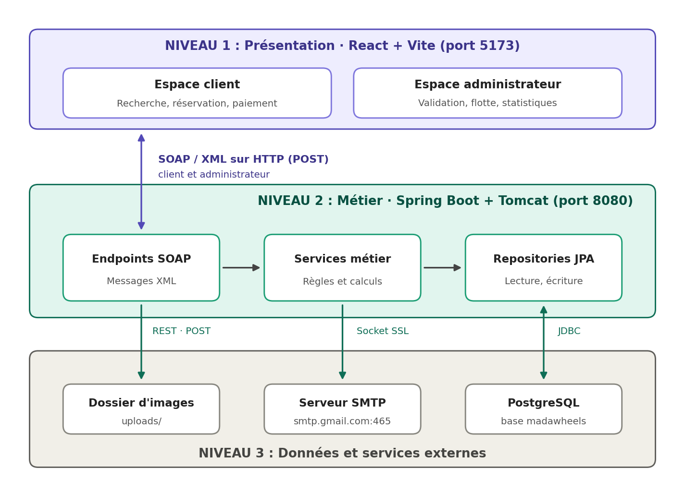

# 🚗 MadaWheels

**Plateforme web de location de véhicules** : les clients réservent en ligne, l'administration valide et gère la flotte.

---

## 📖 À propos

MadaWheels met en relation des **clients** qui souhaitent louer une voiture et une **équipe d'administration** qui gère les véhicules et les demandes de réservation.

Toute la communication entre l'interface (client ou administrateur) et le serveur se fait par **échange de messages XML (services web SOAP) sur HTTP** :

1. le client envoie une demande (par exemple une réservation) ;
2. le serveur la traite et répond en XML ;
3. l'administrateur reçoit la demande, la valide ou la refuse ;
4. le client voit le résultat dans son espace.

---

## ✨ Fonctionnalités

### 👤 Espace client

| Fonctionnalité | Description |
|---|---|
| **Inscription et connexion** | Création de compte avec vérification de l'adresse e-mail par un code reçu par message. |
| **Recherche de véhicules** | Lieu de départ et de retour, dates, heures et âge du conducteur. |
| **Catalogue de la flotte** | Filtres par type, transmission, carburant et prix maximum. |
| **Fiche véhicule** | Photo, caractéristiques (places, portes, carburant, transmission), description et prix par jour. |
| **Réservation** | Choix du véhicule et des options (assurances, équipements) avec calcul automatique du prix total. |
| **Paiement** | Règlement de la réservation en ligne. |
| **Mes réservations** | Suivi du statut de chaque réservation et annulation possible. |
| **Mes devis et mes transactions** | Historique des devis et des paiements. |
| **Profil et paramètres** | Gestion des informations personnelles. |

### 🛠️ Espace administrateur

| Fonctionnalité | Description |
|---|---|
| **Tableau de bord** | Statistiques globales de l'activité. |
| **Réservations** | Consultation des demandes, **validation** avec note ou **refus** avec motif. |
| **Véhicules** | Ajout, modification et suppression de véhicules, import de photos depuis l'appareil. |
| **Clients** | Liste des clients inscrits. |
| **Transactions** | Historique des paiements. |
| **Compte et paramètres** | Gestion du compte administrateur. |

> L'espace administrateur est protégé : seuls les comptes ayant le rôle administrateur peuvent y accéder.

### 🔄 Cycle de vie d'une réservation

```
En attente  ──►  Validée  ──►  Payée   ──►  Terminée
     │
     └────────►  Refusée
```

---

## 🏛️ Architecture

### Type d'architecture

MadaWheels repose sur une **architecture client-serveur à 3 niveaux (3-tiers)**, dont la couche métier est exposée sous forme de **services web SOAP** (architecture orientée services).

| Caractéristique | Application dans MadaWheels |
|---|---|
| **Client-serveur 3-tiers** | Niveau 1 : interface (React). Niveau 2 : logique métier (Spring Boot). Niveau 3 : données (PostgreSQL) et services externes. |
| **Orientée services (SOA)** | Les fonctions du serveur sont publiées comme services web SOAP, décrits par un contrat (XSD) et une description de service (WSDL). |
| **Architecture en couches** | Côté serveur, chaque couche ne dialogue qu'avec la suivante : points d'entrée, services métier, accès aux données. |
| **Application monopage (SPA)** | L'interface se charge une fois, puis dialogue avec le serveur sans recharger la page. |
| **Contract-first** | Le contrat XML (XSD) est écrit en premier ; le code Java et le WSDL en sont générés. |

### Schéma d'architecture



### Rôle de chaque niveau

| Niveau | Composant | Rôle |
|---|---|---|
| **1. Présentation** | Espace client | Recherche, réservation, paiement, suivi des réservations. |
| | Espace administrateur | Validation des réservations, gestion de la flotte, statistiques. |
| **2. Métier** | Endpoints SOAP | Reçoivent les messages XML, les convertissent en objets Java et renvoient la réponse en XML. |
| | Services métier | Appliquent les règles : vérifications, calcul des prix, statuts, envoi des e-mails. |
| | Repositories JPA | Lisent et écrivent les données en base. |
| **3. Données et externes** | PostgreSQL | Stocke utilisateurs, véhicules, réservations et options. |
| | Dossier d'images | Conserve les photos des véhicules importées par l'administrateur. |
| | Serveur SMTP | Envoie les e-mails (code de vérification, confirmation, demande de paiement). |

### Les échanges

| Échange | Technique | Méthode HTTP |
|---|---|---|
| Interface ↔ serveur (toutes les fonctionnalités) | Service web **SOAP** : enveloppe XML | **POST** |
| Description du service (contrat) | **WSDL** généré automatiquement | **GET** |
| Import d'une photo de véhicule | Service **REST** (envoi de fichier) | **POST** |
| Affichage des photos | Fichiers statiques | **GET** |
| Serveur ↔ base de données | JDBC | n/a |
| Serveur → e-mail | Socket TCP sécurisé, dialogue SMTP | n/a |

**Pourquoi SOAP utilise POST :** une requête SOAP contient une enveloppe XML (identité, dates, options…) qui déclenche une action. Elle voyage dans le corps du message, ce qui est le rôle de POST. **GET** sert uniquement à lire (le contrat WSDL, les images).

### Déroulement d'une réservation

| Étape | Acteur | Action |
|---|---|---|
| 1 | **Client** | Envoie une demande de réservation (message XML, POST). |
| 2 | **Serveur** | Calcule le prix, enregistre la réservation et envoie l'e-mail de confirmation. |
| 3 | **Serveur** | Répond au client en XML (référence, statut, prix). |
| 4 | **Administrateur** | Consulte la liste des réservations (message XML). |
| 5 | **Administrateur** | Valide ou refuse la réservation (message XML). |
| 6 | **Client** | Voit le nouveau statut dans « Mes réservations ». |

### Organisation du projet

| Dossier | Contenu |
|---|---|
| `madawheels-backend` | Le serveur : contrat XML, points d'entrée SOAP, services métier, accès aux données, configuration. |
| `madawheels-frontend` | L'interface : pages client, pages d'administration, composants et services d'appel au serveur. |

---

## 🧰 Technologies

| Partie | Technologies |
|---|---|
| **Communication** | XML, XSD, SOAP, WSDL, HTTP (POST, GET), REST (import d'images) |
| **Serveur** | Java 21, Spring Boot, Spring Web Services, JAXB, Spring Data JPA, Tomcat |
| **Base de données** | PostgreSQL |
| **Interface** | React, TypeScript, Vite |
| **E-mails** | Envoi par connexion directe (socket) à un serveur SMTP |

---

## ✅ Prérequis

Installez avant de commencer :

| Outil | Version conseillée |
|---|---|
| **Git** | dernière version |
| **Java (JDK)** | 21 |
| **Node.js** et **npm** | 20 ou supérieure |
| **PostgreSQL** | 14 ou supérieure |

---

## 📥 Cloner le projet

```bash
git clone https://github.com/SOLOMBARATOJO/Wheels.git
cd Wheels
```

Le projet contient deux dossiers :

| Dossier | Rôle |
|---|---|
| `madawheels-backend` | Le serveur |
| `madawheels-frontend` | L'interface web |

---

## 🚀 Démarrage

### Étape 1 : préparer la base de données

1. Démarrez PostgreSQL.
2. Créez une base de données nommée **`madawheels`**.
3. Dans `madawheels-backend/src/main/resources/`, créez le fichier de configuration `application.properties` et renseignez :

| Paramètre | Signification |
|---|---|
| Adresse de la base | `jdbc:postgresql://localhost:5432/madawheels` |
| Utilisateur et mot de passe | Vos identifiants PostgreSQL |
| Dossier des images | `uploads` (créé automatiquement) |
| Adresse du frontend | `http://localhost:5173` |
| Envoi d'e-mails | Activation, serveur SMTP, port, compte et mot de passe |

Les tables sont créées automatiquement au premier lancement.

### Étape 2 : lancer le serveur

```bash
cd madawheels-backend
./mvnw spring-boot:run
```

Sous Windows : `mvnw.cmd spring-boot:run`


### Étape 3 : lancer l'interface

Dans un **second terminal** :

```bash
cd madawheels-frontend
npm install
npm run dev
```

### Étape 4 : ouvrir l'application

| Accès | Adresse |
|---|---|
| **Site client** | http://localhost:5173 |
| **Espace administrateur** | http://localhost:5173/admin |
| **Description du service (WSDL)** | http://localhost:8080/ws/vehicles.wsdl |

> L'adresse `http://localhost:8080/` seule affiche une page d'erreur 404 : c'est normal, le serveur ne propose pas de page d'accueil. L'application se trouve sur le port 5173.

---

## 🏗️ Mode production

| Partie | Commande |
|---|---|
| **Serveur** : générer le programme | `./mvnw clean package` |
| **Serveur** : le lancer | `java -jar target/madawheels-backend-0.0.1-SNAPSHOT.jar` |
| **Interface** : générer les fichiers | `npm run build` (résultat dans `dist/`) |
| **Interface** : tester le résultat | `npm run preview` |

---

## 🔑 Accès administrateur

Un compte administrateur correspond à un utilisateur dont le rôle est **ADMIN** dans la base de données. Pour en créer un :

1. inscrivez-vous normalement depuis le site ;
2. dans la table `users`, changez le rôle de votre compte de `CLIENT` à `ADMIN` ;
3. reconnectez-vous : l'espace administrateur devient accessible.

---

## 🩺 Problèmes fréquents

| Problème | Solution |
|---|---|
| Le serveur ne démarre pas | Vérifiez que PostgreSQL est lancé et que la base `madawheels` existe. |
| Erreur de connexion à la base | Contrôlez l'utilisateur et le mot de passe dans `application.properties`. |
| L'interface n'affiche aucun véhicule | Vérifiez que le serveur tourne sur le port 8080. |
| Aucun e-mail de vérification reçu | Vérifiez les paramètres SMTP, ou consultez les messages du serveur. |
| Port 8080 ou 5173 déjà utilisé | Fermez l'application qui l'occupe, puis relancez. |

---

## 👥 Auteurs

Projet **MadaWheels**, cours Tech Java, M1 GB, ENI.