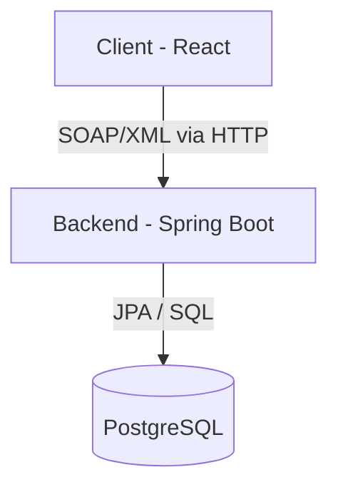

# 🚐 MadaWheels

Application Client/Serveur Java avec Web Service SOAP — projet universitaire (Java avancé).

## 🌟 Fonctionnalités actuelles

- **Gestion de Flotte** : Recherche avancée de véhicules avec filtres (type, transmission, carburant, prix).
- **Réservations** : Création de réservations avec options/assurances, suivi des réservations par utilisateur.
- **Authentification** : Inscription, vérification par code, et connexion utilisateur.
- **Démonstration technique** : Module de démonstration indépendant de Sockets TCP.

---

## 🏗️ Architecture

L'application est divisée en trois composants principaux :

1. **Client (Frontend)** : Interface utilisateur (React + TypeScript).
2. **Backend** : Service métier (Spring Boot + SOAP) avec accès à PostgreSQL.
3. **Demo** : Modules Java indépendants pour la manipulation de sockets TCP.

### Flux de données



> **Note** : Le client ne communique **jamais directement** avec la base de données — tout passe par le Web Service SOAP. Le répertoire `socket-demo` est un module indépendant de démonstration technique.

---

## 📁 Structure du dépôt

MadaWheels/
├── madawheels-backend/ → Spring Boot + Spring-WS + PostgreSQL (Java 21)
├── madawheels-frontend/ → React + TypeScript + Vite
└── socket-demo/ → Démo indépendante Socket TCP (ServerSocket / Socket)

---

## ⚙️ Prérequis

| Outil | Version |
|---|---|
| Java JDK | 21 |
| Maven | 3.9+ |
| PostgreSQL | 14+ |
| Node.js | 18+ |

---

## 📧 Configuration Email (Google)

Pour l'envoi d'e-mails (authentification, vérification), vous devez configurer un accès via un "Mot de passe d'application" Google.

1.  **Activer la validation en deux étapes** sur votre compte Google.
2.  Accédez à **Gérer votre compte Google** > **Sécurité**.
3.  Recherchez **Mots de passe d'application**.
4.  Créez un nouveau mot de passe d'application (nommez-le, par exemple, "MadaWheels").
5.  Copiez le mot de passe généré (16 caractères).
6.  **Emplacement** : Collez ce mot de passe dans le fichier `madawheels-backend/src/main/resources/application.properties` en remplacement du mot de passe de votre compte Google :

    ```properties
    spring.mail.password=VOTRE_MOT_DE_PASSE_APPLICATION
    ```

---

## 🚀 Démarrage rapide

### 1. Cloner le dépôt

```bash
git clone https://github.com/TsioryRaph/Madawheels.git
cd Madawheels
```

### 2. Base de données PostgreSQL

Créez la base de données :

```sql
CREATE DATABASE mada_wheels;
```

*Note : Le schéma est généré automatiquement par Hibernate au lancement du backend.*

### 3. Backend (Spring Boot)

```bash
cd madawheels-backend
# Configurer src/main/resources/application.properties avec vos accès DB
mvn clean install
mvn spring-boot:run
```

- API SOAP : `http://localhost:8080/ws`

### 4. Frontend (React)

```bash
cd madawheels-frontend
npm install
npm run dev
```

- App : `http://localhost:5173`

### 5. Démo Socket TCP (optionnelle)

```bash
cd socket-demo
# Compiler et exécuter ServerSocketDemo puis SocketClientDemo
```

---

## 🤝 Workflow de collaboration

Le projet utilise Git. Suivez ce cycle pour contribuer :

```bash
# Avant tout travail, synchronisez votre branche locale
git pull origin main

# Effectuez vos changements sur une branche dédiée (recommandé)
git checkout -b feature/ma-nouvelle-fonctionnalite

# Stage et commit
git add .
git commit -m "feat: ajout de la fonctionnalité X"

# Pousser vos modifications
git push origin feature/ma-nouvelle-fonctionnalite
```

*Ne jamais pousser directement sur `main` sans revue.*
